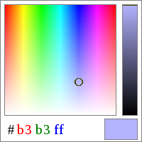
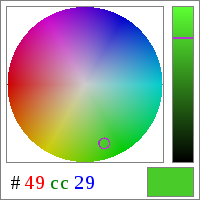
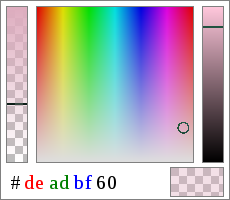

# HtmlPalette 

An HTML5 color picker designed to be intuitive and easy to use. Comes in square and radial versions.

[Live demo](https://stevenvergenz.github.io/html-palette/) [Minified](https://raw.githubusercontent.com/stevenvergenz/html-palette/master/build/html-palette.min.js) [Uncompressed](https://raw.githubusercontent.com/stevenvergenz/html-palette/master/build/html-palette.js)

  


## Examples

### Vanilla JS

```javascript
var trigger = document.getElementById('picker');
var palette = new HtmlPalette(trigger, {
	initialColor: '49cc29',
	colorCallback: function(color){
		trigger.style['background-color'] = '#'+color.hex;
	}
});
```

### jQuery

```javascript
$('#picker').HtmlPalette({
	initialColor: {h:0, s:0.8, v:0.8},
	colorCallback: function(color){
		this.triggerElem.style['background-color'] = '#'+color.hex;
	}
});
```

### Angular.js

```javascript
angular.module('myApp', ['html-palette'])
	.controller('MyController', function($scope){
		$scope.color = {r: 0.8, g: 0.3, b: 1.0};
	});
```

```html
<div ng-app='myApp'>
	<div ng-controller='MyController'>
		<html-palette color='color'></html-color>
	</div>
</div>
```

## Usage

Include the script and stylesheet on your page, and you're ready to go.

```html
<link rel='stylesheet' href='palette.css'/>
<script type='text/javascript' src='html-palette.min.js'></script>
```

The constructor for HtmlPalette has three versions, depending on what library you want to use for your workflow. They all take two things though: a trigger element and an options object. When the trigger element's `click` event is fired, the color picker will appear next to it. The available options are detailed in the Options section below.

* **Vanilla Javascript**:

	Construct an instance, and interact with it directly.

	```javascript
	var palette = new HtmlPalette(trigger, options);
	palette.option = true;
	palette.destroy();
	```

* **jQuery**:

	Initialize and interact using the jQuery extension.

	```javascript
	$(trigger).HtmlPalette(options);
	$(trigger).HtmlPalette('option', true);
	$(trigger).HtmlPalette('destroy');
	```

* **Angular.js**:

	The picker takes the form of a directive, so you can add it straight into your HTML, no Javascript required. The scope variable referred to by the attribute `color` is bi-directionally bound to the picker's selected color, in the format specified by the `color-profile` attribute. Note that an alpha value is only available to the RGB and HSV versions, not hex. Additional picker attributes are mapped to options in the usual Angular fashion: hyphenated to camel-case.

	```javascript
	angular.module('my-app', ['html-palette'])
	.controller('MyController', function($scope){
		$scope.myColor = {hex: 'deadbe', a: 0xef/0xff};
		$scope.$watch('myColor', function(newval){
			console.log('You have selected the color', newval);
		});
	});
	```

	```html
	<div ng-controller='MyController'>
		<html-palette color='myColor' popup-edge='nw'></html-palette>
	</div>
	```

## Color Representations

This library uses three different representations for colors:

* 24-bit hexidecimal string, e.g. `'ffcc00'`
* RGB(A) object, with channel values in interval [0,1], e.g. `{r:1, b:0.75, g:0, a:1}`
* HSV(A) object, with channel values in interval [0,1], e.g. `{h:0, s:0.75, v:0.8}`

Alpha value is initialized to 1.0 unless specified. Any of these representations can be passed into the `initialColor` option or `color` setter method, and the other representations will be computed and provided to the color callback.


## Options/Properties

All options are also available for read/write on the resulting HtmlPalette instance, with exceptions noted. Options indicated as "offscreen only" will be applied the next time the popup is raised.

### colorCallback

*Type*: `function(color)`

*Default*: `null`

A function called when the selected color changes, either from picker events or a call to the `color` setter function. The callback is passed an object containing all three representations of the active color (keys `r,g,b`, `h,s,v`, `a`, and `hex`). All three versions represent the same color.

In addition to the raw color values listed above, the callback argument provides two other properties:

* `css` - A string representing the given color using the CSS `rgba` function. E.g. `"rgba(200, 100, 50, 1.0)"`. This is provided because the `hex` format doesn't support the alpha channel.
* `background` - A CSS string representing the given color composed over a grey and white checked background for alpha visualization. Useful for color preview purposes.

### colorSelectCallback

*Type*: `function(color)`

*Default*: `null`

A function called when the selected color is no longer changing, either because it was an instantaneous (i.e. programmatic) change, or because the user has stopped interacting with the picker. This function's argument is identical to that of `colorCallback`.

In the included Angular.js binding, this option is available as the attribute 'on-color-select', whose value expression is evaluated in the previously mentioned circumstances.

### disabled

*Type*: `boolean`

*Default*: `false`

When disabled the trigger will not bring up the color picker when clicked. In the Angular.js binding, this is a watched expression.

### popupEdge

*Type*: `String`

*Default*: `'se'`

Determines where the picker will appear relative to the trigger element. Can be one of the eight cardinal directions: `'n'`, `'nw'`, `'w'`, `'sw'`, `'s'`, `'se'`, `'e'`, or `'ne'`.

### radial (offscreen only)

*Type*: `boolean`

*Default*: `false`

If `false`, the color picker is drawn as a rectangle, with hue varying on the x axis and saturation varying on the y axis. If `true`, it is drawn as a circle, with hue varying with the angle and saturation varying with the radius.

### updateTriggerBg

*Type*: `boolean`

*Default*: `false`

When enabled, the picker trigger element's `background` style will be changed to the current selection color, with a checker pattern to indicate transparency if applicable.

### css (offscreen only)

*Type*: `String`

*Default*: `undefined`

When supplied, this class is applied to the picker popup.

### initialColor (constructor option only)

*Type*: `String`|`Object`

*Default*: `'aaaaaa'`

The initial color selection of the picker. The color callback will be called once on initalization with this color, if a callback is provided on initialization.

### useAlpha (offscreen only)

*Type*: `boolean`

*Default*: `false`

If specified, the widget controls will include a slider for the alpha channel. This might require changing the dimensions of the popup via the `css` property for a good user experience.

### throttleApply (Angular.js attribute only)

*Type*: `Integer`

*Default*: `0`

The Angular.js directive will set the values of the bound object, but will not call `$apply` until the color is unchanged for *throttleApply* milliseconds.

### colorProfile (Angular.js attribute only)

*Type*: `String`

*Default*: `undefined`

This attribute controls which color properties are copied over to the bound model. If the attribute is a string of any of the letters `h,s,v,r,g,b,a`, then the corresponding color fields will be copied. If it is the string `hex`, then only the hex representation will be copied. Otherwise, all color attributes (`h,s,v,r,g,b,a,hex,css,background`) are copied.

## Other Instance Properties

* `triggerElem` - The element whose `click` event brings up the picker.
* `selection` - The internal color selection. Do not modify this directly, use the `color` method instead.

## Instance Methods

### color([newcolor])

The getter/setter function for the picker's currently selected color. If called with no arguments, i.e. `color()`, the method returns an object with properties `r, g, b`, `h, s, v`, and `hex`, corresponding to the three color representations noted above. If called with one argument, i.e. `color(newcolor)`, the selection color is set to the specified color (in any of the three representations), and the color callback is called if supplied.


### destroy()

Unregister the click listener on the trigger element.
